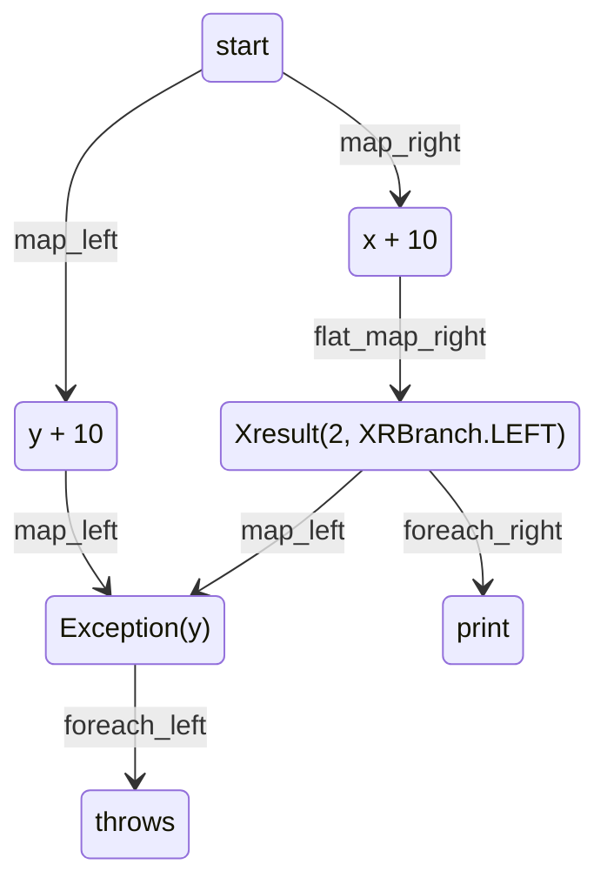

<h1 style="font-weight: bold">Effects</h1>

{: .further-reading }
Effects handling in XFP are based on the functional pattern [railway oriented programming](https://naveenkumarmuguda.medium.com/railway-oriented-programming-a-powerful-functional-programming-pattern-ab454e467f31)

As you may see in [Functional Programming in Python](/python-fp/functional_programming/), a good practice is to encode semantic in your functions signatures. XFP provides a unique way to encode different semantics at once through its Xresult type. 

## What is an effect

In the functional world, an effect is the description of an operation interacting with the outside world, thus making the function unpure. It ranges from I/O operation to mutating something not in in the function scope. Its consequences (overly simplified) result often in something that is not a value (much like `None` or raising `Exception`).

```python
import pandas as pd
import math
# read_csv raises FileNotFoundError when phantom_file does not exist
df = pd.read_csv("phantom_file.csv") 

# sqrt return None when i < 0. The function is partial
def sqrt(i):
    if i >= 0:
        return math.sqrt(i)
```

One of the property of the function is that it should always return a value. Therefore effects break the functional paradigm and should be handled. Python handles them with keywords, however we will handle them with values, introducing the Xresult XFP type to **catch the output of an effect**.

```python
import pandas as pd
# Python handles errors with try/except
try:
    df = pd.read_csv("phantom_file.csv")
except Exception as e:
    print(e)
```

## Mecanisms

### Type Structure

`Xresult[Y, X]` can be seen as a collection of one unique element `value`, being either of type Y or X. It always holds a `branch` attribute as a semaphore of which type between X or Y is used. branch is a value of the `XRBranch` enumeration, equals to `XRBranch.LEFT` if the `value` is a Y or a `XRBranch.RIGHT` if the value is a LEFT.  

```python
from xfp import Xresult, XRBranch
from typing import Any
import math

result1: Xresult[Any, int] = Xresult(3, XRBranch.RIGHT)
result2: Xresult[str, Any] = Xresult("abc", XRBranch.LEFT)

# this is a preview of the added semantic of returning an Xresult
def partial_sqrt(i: int) -> Xresult[str, int]:
    if i >= 0:
        return Xresult(math.sqrt(i), XRBranch.RIGHT)
    else:
        return Xresult(f"{i} cannot be square rooted", XRBranch.LEFT)
```

{: .note }
You may find the partial_sqrt error handling tedious. This is completely normal since this is an overview of the plain effect handling in xfp. For more information about quality of lifes with effects, see [Wrapping Python](/python-fp/results/wrapping_python)

### API

#### As a collection

As a collection with a unique element, Xresults are homogene with the [Collections](/python-fp/collections/) API. It means you can process the value of an Xresult using the standard `map`, `flat_map`, `filter` & co functions. However to take the branch into account, each function is divided into a "_left" and a "_right" version, each one either applying the transformation if the branch corresponds, or being a go-through otherwise.

```python
from xfp import Xresult, XRBranch

def throws(x: Exception):
    raise x

start = Xresult(1, XRBranch.RIGHT)
stop = (
    start
    .map_right(lambda x: x + 10)                            # XRBranch(1 + 10, XRBranch.RIGHT) because result is a RIGHT
    .map_left(lambda y: y * 20)                             # go-through because result is a RIGHT
    .flat_map_right(lambda x: Xresult(2, XRBranch.LEFT))    # Xresult(2, XRBranch.LEFT) because the initial result is a RIGHT
    .map_left(lambda y: Exception(y))
)

stop.foreach_right(print)                                   # doesn't print anything
stop.foreach_left(throws)                                   # raise Exception(2)
```



{: .note }
For convenience, Xresult is right-biased, meaning a non-suffixed function is a proxy for a "_right" one. For example `my_xresult.map(f)` is the same as `my_xresult.map_right(f)`

### Result branching

The collection API provides a bunch of functions that operate on the value to either transform it or to return a new Xresult (`map`, `flat_map`). However the Xresult itself add some functionalities to work on its branch (and optionally change its value). As before, every function exists in a left and right version, the unsuffixed one being a synonym for the right.  
`filter` returns a new Xresult being the opposite branch with the value holding a default error if the predicate is not met.  
`recover_with` is an alias over flat_map, on the opposite branch (`recover_with_left` = `flat_map_right`). It is meant to try to re-shift to the current bias.
`recover` holds a similar semantic as `recover_with` but with an absolute recovery method.

```python
from xfp import Xresult, XRBranch

(
    Xresult("I am the wrong value", XRBranch.LEFT)  # Let's encode an 'error' in the LEFT path
    .recover_right(lambda err_msg: len(err_msg))     # Xresult(20, XRBranch.RIGHT)
    .filter_right(lambda size: size < 5)             # Xresult(XresultError(...), XRBranch.LEFT)
)
```

## Integrate Semantic

In [Result branching](#result-branching) we started implying the existence of a "right" path, and an "error" one. While you should remember the mechanical behavior of Xresult, it is of equal importance to understand how it adds semantic to your code. It is a common and a good practice to encode a main value on one side, and a value representing the side effect on the other side.

```python

from xfp import Xresult, XRBranch
import math

# Xresult[None, X] formally encodes an optional value while keeping the power of a collection
def partial_sqrt(i: int) -> Xresult[None, int]:
    if i >= 0:
        return Xresult(math.sqrt(i), XRBranch.RIGHT)
    else:
        return Xresult(None, XRBranch.LEFT)

# imperative vanilla python, the user needs to have a look at the documentation to understand the behavior of the function
def unsafe_function(i: int) -> str:
    if i > 0:
        return i
    else:
        raise Exception("break")

# with XFP, the unsafe behavior is encoded in the function signature, enforcing the code auto documentation
def unsafe_function(i: int) -> Xresult[Exception, str]:
    # We even credit ourselves with not writing the implementation in this example
    # since every case is visible in the return type
    pass
```

## Xeither, Xtry, Xopt

In the above example, you noticed some tedious notation, among them being always forced to explicitely set the branch. For the sake of simplicity, but also to improve furthermore the semantic behind the Xresult, subclasses `Xeither`, `Xopt` and `Xtry` allow to directly create certain types of Xresult.  
You will find more information about advanced usage of those types and integration with vanilla Python in the [Pattern Matching](/python-fp/pattern_matching/) and [Wrapping Python](/python-fp/wrapping_python) sections.

```python
from xfp import Xresult, Xeither, Xopt, Xtry
from typing import Any

# Xeither reproduces a plain mechanical "or" value
a_right: Xresult[Any, int] = Xeither.Right(3)
a_left: Xresult[int, Any] = Xeither.Left(3)

# Xopt reproduces an optional value, formally
some_value: Xresult[None, int] = Xopt.Some(3)
empty_value: Xresult[None, Any] = Xopt.Empty

# Xtry allows you to directly bind your Xresult to Exception semantic
success: Xresult[Exception, int] = Xtry.Success(3)
failure: Xresult[Exception, Any] = Xtry.Failure(Exception("Something went wrong"))

```

Using any of them will drastically improve the readability of your Xresult usages : 

```python
from xfp import Xresult, Xtry

# Now the behavior is encoded in the signature
# AND it becomes trivial to see the outcome of each branch of the code
def partial_sqrt(i: int) -> Xresult[Exception, int]:
    if i >= 0:
        return Xtry.Success(math.sqrt(i))
    else:
        return Xtry.Failure(Exception(f"{i} cannot be square rooted"))
```
